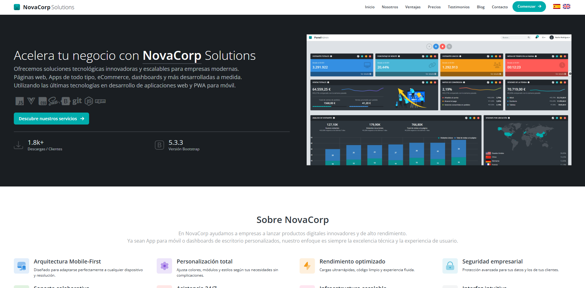

# 🌐 Landing Page Corporativa

[](https://kvothe73.github.io/landing)

🔶 Landing page corporativa genérica, construida con **Vue 3** y **TypeScript**, completamente multilingüe y responsive.

🔶 Incluye navegación seccional (`home`, `about`, `features`, `pricing`, etc.), un formulario de contacto funcional, selector de idioma (es/en) y vista adaptada a escritorio y móviles.

🔶 Cada sección utiliza textos internacionalizados a través de `vue-i18n` y está diseñada para ser visualmente clara y corporativa.

🔶 Este proyecto forma parte de mi portfolio profesional y está pensado para mostrar ejemplos de landings corporativas listas para adaptar a cualquier cliente.


---

## 📸 Vista previa



---

## 🚀 Tecnologías utilizadas

- [Vue 3](https://vuejs.org/) + Composition API
- [TypeScript](https://www.typescriptlang.org/)
- [Bootstrap 5.3](https://getbootstrap.com/)
- [SASS / SCSS](https://sass-lang.com/)
- [vue-i18n](https://github.com/intlify/vue-i18n-next)
- [Lity](https://sorgalla.com/lity/) (Lightbox)
- [Iconify](https://iconify.design/) (para íconos SVG)
- [localStorage API](https://developer.mozilla.org/en-US/docs/Web/API/Window/localStorage)

---

## 🗂️ Estructura principal

```
public/
│ └── assets/
│       └── img/landing/        # Imágenes estáticas para las secciones de Features y Gallery
src/
├── views/
│       └── LandingPage.vue     # Vista principal con todas las secciones
├── assets/
│       └── flags/              # Banderas de idiomas
├── i18n/
│       └── messages.ts         # Archivos de texto en español e inglés
├── main.ts                     # Punto de entrada
├── App.vue                     # Componente raíz
└── ...
```

---

## ✨ Funcionalidades principales

- 🌐 Selector de idioma persistente (Español / Inglés)
- 🎨 Soporte visual para tema oscuro y claro
- 📌 Secciones clásicas: Home, About, Features, Pricing, Testimonials, Blog, Contact
- 📷 Galería interactiva con vistas previas de proyectos
- 📦 Formulario de contacto simulado
- 🖥️ Totalmente responsive y accesible desde dispositivos móviles

---

## 🧩 Organización del código

- `template`: Vista estructurada y comentada por bloques (`#home`, `#about`, `#features`, etc.)
- `script setup`: Computeds y lógica de selección de idioma, planes de precios, testimonios y blog dinámicos
- `style`: Estilos scoped, bien organizados por función (banderas, efectos de escala, botones destacados)

---

## 🛠️ Instalación y uso

```bash
# Clona el repositorio
git clone https://github.com/KVOTHE73/landing.git
cd landing

# Instala dependencias
npm install

# Ejecuta en modo desarrollo
npm run dev

# Compila para producción
npm run build

# Vista previa local de la build
npm run preview
```

---

## 📅 Metainformación

📁 Proyecto: Landing Page Corporativa

🧠 Autor: [Nacho Rodríguez](https://www.nacho-rodriguez.com)

📦 Tipo: SPA multilingüe responsive

🎯 Finalidad: Portfolio personal / Demostración de estructura de landing profesional

🔗 Licencia: MIT

📣 Puedes ver una demo del proyecto en vivo aquí:
🟢 **[Ver demo online](https://kvothe73.github.io/landing)**
